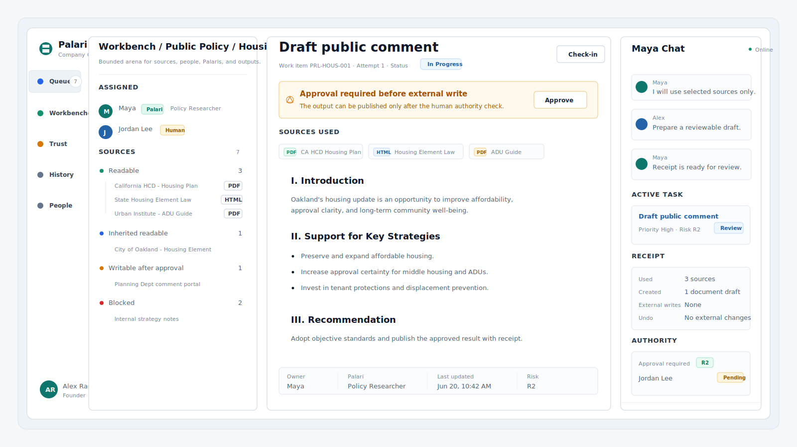

# Palari Company OS

[](https://github.com/CoyStan/palari-company-os/actions/workflows/ci.yml)
[](pyproject.toml)
[](LICENSE)
[](docs/product/roadmap.md)



Palari Company OS is a repo-native operating layer for AI-assisted company
work. It models the loop between human intent, named AI work partners,
selected sources, bounded execution, receipts, evidence, review, human
authority, and outcomes.

It is intentionally not the older Palari Orchestrator ceremony. This repo is a
smaller, cleaner Python CLI foundation for making AI work legible without
turning every task into process paperwork.

## Why It Exists

AI work gets messy when the company cannot answer basic operational questions:

- What is the goal?
- Which Palari or human is working on it?
- What sources may be read?
- What output may be changed?
- What is running in parallel?
- What did the attempt actually use, create, skip, or leave undoable?
- What evidence and review exist?
- Who has the authority to approve the result?

Palari Company OS keeps those answers in inspectable workspace files and
derives fast operator views from them.

## Current Status

This is a **v0.1 alpha local CLI**. It is useful for modeling and dogfooding the
core operating system, but it is not yet a production platform.

Implemented now:

- strict workspace schema v1
- goals, humans, Palaris, workbenches, sources, work items, attempts, receipts,
  evidence, reviews, human decisions, outcomes, and history
- queue/detail/state read models
- agent packet contract for bounded AI-agent work context
- fail-closed validation for references, stale evidence, stale reviews,
  authority, quorum, receipts, workbench boundaries, and parallel-work conflicts
- source and receipt trust loop for low-risk local work
- workbench graph and parallel work visibility
- dry-run integration plans, human approval decisions, and cancelable integration outbox
  records without live provider calls
- external playbook recommendations as lightweight guidance
- static dashboard and desktop-shell prototype generators
- repo-local dogfood workspace
- dependency-free Python package with CI and install smoke tests

Intentionally not implemented yet:

- real broker execution
- real policy acceptance
- live Slack/GitHub/Jira/email connector execution
- Google Drive or v05 integration
- production deployment
- enterprise administration
- signed key custody
- autonomous acceptance, merge, push, or deploy

## Install

From the repo root:

```bash
python3 -m pip install -e .
palari --help
```

Or use the repo-local wrapper without installing:

```bash
./bin/palari --help
```

Palari Company OS currently has no runtime package dependencies beyond the
Python standard library.

## Quickstart

The default workspace is the ACME example:

```bash
./bin/palari validate
./bin/palari queue
./bin/palari detail WORK-0001
./bin/palari state
./bin/palari data map
```

Use JSON when wiring the CLI into tools or agents:

```bash
./bin/palari queue --json
./bin/palari detail WORK-0007 --json
./bin/palari state --json
```

Create a blank local workspace when you do not want to hand-write the shell
JSON:

```bash
./bin/palari workspace init workspaces/my-company --name "My Company"
./bin/palari --workspace workspaces/my-company validate
```

For agents, start from one bounded packet instead of inferring the workflow:

```bash
./bin/palari agent next --json
./bin/palari agent next --as PALARI-SOFIA --json
./bin/palari agent brief WORK-0003 --as PALARI-SOFIA --mode execute --json
./bin/palari agent brief WORK-0007 --as PALARI-SOFIA --mode review --json
./bin/palari agent check WORK-0003 --as PALARI-SOFIA --mode execute --json
./bin/palari agent finish WORK-0003 --as PALARI-SOFIA --json
./bin/palari agent handoff WORK-0003 --as PALARI-SOFIA --json
./bin/palari agent loop WORK-0003 --as PALARI-SOFIA --json
./bin/palari review guide WORK-0003 --json
```

Bare `agent next` returns the all-Palaris rollup with a top candidate and a
`next_step_type` such as `check-active-proof`, `review-handoff`, or
`human-decision`. `agent check` and `agent finish` carry the same step type and
tell an agent which receipt, evidence, review, or human decision record is
still needed before it can claim completion. When proof is missing, concrete
receipt, evidence, and review commands appear before generic inspect/validate
commands, and human-decision commands are held until prerequisite proof exists.
`agent handoff` is the preferred bridge for human review or decision states; it
packages the relevant finish, review-guide, or decision-guide context without
mutating the workspace, while keeping human action commands separate from
agent-safe reads. For work that is already waiting for review or receipt-ready,
`agent brief --mode review` returns a read-only reviewer packet with review
focus, attempt/evidence/receipt context, and review guide commands. In review
mode, `agent finish` means the agent may report a review recommendation, not
record a human review or claim the original work item is complete. `agent loop`
summarizes the current brief/check/finish/handoff state when an agent needs the
whole control flow without dumping every detailed payload.

Run against another workspace:

```bash
./bin/palari --workspace workspaces/palari-company-os queue
./bin/palari --workspace workspaces/palari-company-os detail WORK-REPO-0001
```

Generate the static dashboard:

```bash
./bin/palari dashboard --out /tmp/palari-company-dashboard
```

Generate the desktop-shell prototype:

```bash
./bin/palari desktop-prototype --out /tmp/palari-desktop-prototype
```

Serve the prototype locally:

```bash
./bin/palari desktop-serve --out /tmp/palari-desktop-prototype --port 8787
```

## Core Model

Palari Company OS is organized around a few explicit records:

| Object | Purpose |
| --- | --- |
| Goal | Company intent and success criteria. |
| Human | Authority holder, reviewer, owner, or operator. |
| Palari | Named AI work partner with scope, standards, and boundaries. |
| Workbench | Bounded arena for shared context, sources, targets, people, and parallel work. |
| Source | Selected readable context with provider and access boundaries. |
| Work item | Intended unit of work with scope, risk, dependencies, targets, and policy. |
| Attempt | Concrete execution by a human, Palari, worker, agent, or pair. |
| Receipt | Human-facing trust record: used, created, wrote, did not do, and undo refs. |
| Evidence | Verification tied to an artifact state or head. |
| Review | Independent inspection of the evidence/result. |
| Human decision | Authority-bearing approval, rejection, or blocker. |
| Outcome | Learning record after the work is closed. |

The product loop is:

```text
goal -> workbench -> selected sources -> work item -> attempt
  -> receipt -> evidence/review/human decision when risk requires it
  -> outcome and learning
```

## Important Commands

```bash
# Read models
./bin/palari queue
./bin/palari detail WORK-0001
./bin/palari state
./bin/palari history

# Safety and boundaries
./bin/palari validate
./bin/palari scope WORK-0001 --changed examples/acme-company-os/workspace.json

# Lightweight process guidance
./bin/palari playbooks sources
./bin/palari playbooks recommend WORK-0003

# Static visual surfaces
./bin/palari dashboard --out /tmp/palari-company-dashboard
./bin/palari desktop-prototype --out /tmp/palari-desktop-prototype

# External maintainer repo status
./bin/palari maintainer status --repo .
```

Authoring and lifecycle commands exist for the core records. See the
[Command Reference](docs/product/command-reference.md) and
[Lifecycle Guide](docs/product/lifecycle-guide.md).

## Repository Layout

```text
bin/palari                         CLI wrapper
src/palari_company_os/             Python package
schemas/workspace.schema.json      Inspectable workspace schema
examples/acme-company-os/          Small example workspace
workspaces/palari-company-os/      Repo dogfood workspace
docs/product/                      Product and operator documentation
docs/assets/                       README and documentation assets
scripts/verify.sh                  Full local verification
scripts/install_smoke.sh           Isolated package install smoke
tests/                             Unit and fixture tests
```

## Verification

Run the normal local verification stack:

```bash
./scripts/verify.sh
python3 -m unittest discover -s tests
./scripts/install_smoke.sh
```

`./scripts/verify.sh` runs unit tests, Python compilation, JSON validity checks,
the lightweight style checker, and CLI smoke checks. `install_smoke.sh` creates
a temporary virtual environment, builds and installs a wheel, imports it, checks
the installed `palari` command, and confirms packaged default fixtures work.

GitHub Actions runs the same core checks on Python 3.10 and 3.12.

## Design Principles

- **Human authority stays explicit.** AI can prepare and explain work; it does
  not silently accept, merge, deploy, activate policy, or expand its own scope.
- **Sources are selected.** A Palari should know what it can read and what it
  cannot read.
- **Receipts are for trust.** Receipts explain what happened in human terms;
  they are not a replacement for governance evidence.
- **Risk changes intensity.** Low-risk local work can stay light. Higher-risk
  work still requires evidence, review, and human decision.
- **Read models do not mutate authority.** Queue, detail, state, dashboard, and
  prototypes are derived from workspace data.
- **Ordinary software maintenance wins.** This repo should stay simple,
  inspectable, dependency-light, and easy for agents and humans to work on.

## Documentation

- [Product Model](docs/product/company-os.md)
- [Quickstart](docs/product/quickstart.md)
- [Core Objects](docs/product/core-objects.md)
- [Authority And Gates](docs/product/authority-and-gates.md)
- [Source Of Truth](docs/product/source-of-truth.md)
- [Schema And Validation](docs/product/schema-and-validation.md)
- [Command Reference](docs/product/command-reference.md)
- [Agent Loop Smoke](docs/product/agent-loop-smoke.md)
- [Lifecycle Guide](docs/product/lifecycle-guide.md)
- [External Playbooks](docs/product/playbooks.md)
- [External Maintainer Mode](docs/product/external-maintainer-mode.md)
- [Testing Guide](docs/product/testing-guide.md)
- [Security Notes](docs/product/security.md)
- [Contributing](docs/product/contributing.md)
- [Roadmap](docs/product/roadmap.md)
- [Changelog](CHANGELOG.md)

## License

MIT. See [LICENSE](LICENSE).
