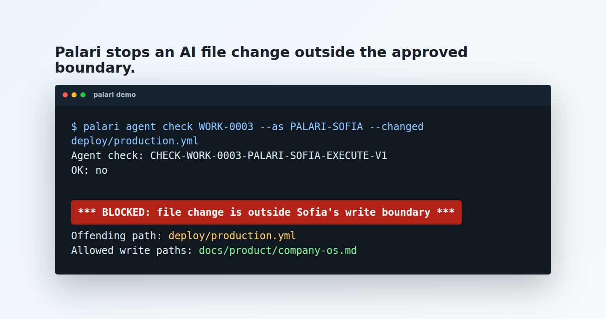

# Palari Company OS

AI agents can change files faster than people can review them. Palari gives
them a visible boundary and stops them when they cross it.



Maya asks Sofia to clean up launch notes.

Sofia is allowed to read the selected notes and change one docs file.

Then Sofia tries to touch `deploy/production.yml`.

Palari stops the run:

```text
*** BLOCKED: file change is outside Sofia's write boundary ***
changed: deploy/production.yml
allowed: docs/product/company-os.md
```

The human sees what Sofia tried, what was allowed, and the next safe command.

That is the product: AI work with a boundary you can inspect.

## Quickstart

Requirements: Python 3.10 or newer and Git.

Two commands from a fresh clone:

```bash
git clone https://github.com/CoyStan/palari-company-os.git && cd palari-company-os
./bin/palari demo
```

Or install it first:

```bash
python3 -m pip install -e .
palari demo
```

The demo is offline and uses a throwaway temp directory. It shows the blocked
file change, a committed in-bound change, and one `agent advance` deriving the
receipt and evidence needed to close safe low-risk local work.

Then open the same throwaway demo in the live local supervision desk:

```bash
./bin/palari demo --serve
```

The demo server is local only by default. It lets you click through work that
needs human attention while the temporary files remain the source of truth.

To adopt it in your own repo, create the local contract, add bounded work, and
let any agent claim the next safe item:

```bash
palari init --palari Agent --host codex --json
palari work add "Clean up launch notes" --write docs/notes.md --json
palari agent start --next --as PALARI-AGENT --json
```

`init` creates missing `AGENTS.md` and `docs/agent/` orientation without
overwriting existing guidance. In a Git worktree it also creates one local,
path-limited bootstrap commit containing only the new governance projection and
newly generated agent docs. With `--host`, the same commit also anchors new
project-local host configuration and installs the claim-bound Git commit gate.
That commit is an immutable execution-authority anchor, not human approval;
unrelated staged and unstaged work is excluded. Choose `claude` or `codex`.
Codex asks you to review the exact project hook once through `/hooks`; Palari
cannot manufacture that host trust.
For a workspace nested inside a repository, adoption targets the enclosing Git
root. Existing root instructions or host configuration remain untouched and
uncommitted; `init` returns one separate review/adoption action instead of
absorbing those bytes into the authority anchor. Generated hook commands use an
inspectable project-local launcher when present; otherwise they preserve the
absolute Palari entrypoint currently running or a validated `PATH` entry. An
isolated installed package therefore remains usable even when `palari` is
absent from `PATH`.

Use the declared identity returned by `init` (`PALARI-AGENT` for the command
above), then use the opaque work ID returned by `start` after doing and
committing the bounded work:

```bash
palari agent advance WORK-RETURNED-BY-START --as PALARI-AGENT --json
```

Do not infer a sequential work ID. For a repository that already has a Palari
workspace, run `palari init WORKSPACE-DIR --host HOST --as PALARI-ID --json`
once. Existing-workspace initialization is accepted only when `--host` makes
the idempotent adoption intent explicit; it never rewrites the workspace.
Claude and Codex receive tested session hooks. Other harnesses can follow the
provider-neutral repository contract and use the host-neutral Git gate, but
Palari does not expose an unproven session profile for them. The core packet,
claim, proof, review, and human-decision flow remains provider-neutral.

Adoption preflights `workspace.json` and every managed target before writing.
A workspace-file symlink, parent escape, malformed managed target, or unmanaged
Git pre-commit hook fails closed. Co-located foreign host hooks are preserved;
legacy Palari-managed Claude hooks are upgraded in place and remain cleanly
removable.

Use `--write PATH` when only the output's final presence matters. When mutation
type matters, declare it exactly and do not mix the forms:

```bash
palari work add "Replace obsolete guidance" \
  --create docs/new.md --modify docs/current.md --delete docs/obsolete.md
```

See the [Quickstart](docs/product/quickstart.md) for the full path.

## What Palari Is

[](https://github.com/CoyStan/palari-company-os/actions/workflows/ci.yml)
[](pyproject.toml)
[](LICENSE)
[](docs/product/roadmap.md)

Palari Company OS is a local, file-backed control plane for AI-assisted work.
It helps humans and AI agents agree on:

- what the agent is trying to do
- which sources it may read
- which files or outputs it may change
- what it actually used, created, skipped, or left undoable
- when a human must review or approve the work

It is not another chatbot. It is the operating contract around AI work: goals,
workbenches, named AI partners, bounded work items, receipts, evidence, review,
human decisions, and outcomes.

Its protocol north star is **Proof-Carrying AI Work (PCAW)**: an independent
party can take one canonical statement plus its named artifacts and verify the
governance claim offline, without the original workspace, provider, network,
credentials, or source contents. See the normative [PCAW v1
specification](spec/pcaw/v1/README.md).

Its operator complement is the **Approval Inbox**: agents may prepare many
bounded, individually proven items, while one human review session can approve
an exact eligible bundle. The interaction is compressed; evidence and
authority are not. Content-addressed checkpoints make local tentative chains
reversible without rewriting history. Restoration fails closed when effects
after the target checkpoint have already escaped the local workspace.

New to those words? Start with the plain-language
[Glossary](docs/product/glossary.md).

## What Works Today

This is a **v0.2 alpha local CLI**. It runs from local files, has no runtime
package dependencies beyond the Python standard library, and does not require
API keys, cloud accounts, databases, Slack, GitHub apps, Google Drive, or a
background service.

Implemented now:

- strict workspace schema and validation
- goals, humans, Palaris, workbenches, sources, work items, attempts, receipts,
  evidence, reviews, human decisions, outcomes, and history
- queue, detail, state, history, and Mission Control views
- agent packets for bounded AI-agent context
- local packet persistence and lightweight claims for `agent start`
- deterministic next-safe selection and claiming through `agent start --next`
- one deterministic `agent advance` convergence path that stops at independent
  review, exact human authority, external effects, or concrete blockers
- durable `agent release --reason ... --next-action ...` interruptions that
  record a blocked attempt and next safe action before releasing the owned claim
- file-change boundary checks for `agent check --changed` and `--git-diff`
- explicit create, modify, and delete path intents; declared deletion is checked
  as an exact absent-path tombstone instead of being mistaken for a missing file
- canonical path/symlink enforcement and metadata-only start baselines that
  distinguish unchanged pre-existing dirt from agent changes
- one-action host adoption with a provider-neutral contract and claim-bound
  Git gate plus tested project-local Claude and Codex session hooks
- source and receipt trust records
- exact attempt/receipt/evidence/work-contract review binding, immutable bound
  reviews, and latest-decision quorum revocation
- deterministic PCAW v1 proof export and offline verification with strict
  canonical JSON, exact artifact digests, and a provider-neutral conformance corpus
- staged, hash-chained governance journaling for new or explicitly checkpointed
  workspaces, with replay, corruption detection, and crash recovery
- canonical Approval Packs with item-level proof, dependency-aware staleness,
  one exact human decision, risk-based batching, and parked external effects
- parked content-addressed checkpoint restoration for local human recovery,
  outside the ordinary supported lifecycle and with explicit external-effect
  non-guarantees
- parallel workbench modeling and conflict warnings
- dry-run integration plans, approvals, and cancelable outbox records
- a governed Linear adapter: `linear connect` setup, issue discovery and
  imports, pull sync, human-approved comment, status-update, and
  issue-creation sends, and verified Issue webhooks
  ([Linear Operating Loop](docs/product/linear-operating-loop.md))
- parked external playbook recommendations as non-authoritative guidance
- example and dogfood workspaces
- CI, local verification, and install smoke tests

Not implemented yet:

- live Slack, GitHub, Jira, email, Google Drive, or document connector execution
- hosted web app or multi-user server
- background agent runner
- generic broker execution beyond the approved Linear adapter
- real policy acceptance
- secret manager or signed key custody
- autonomous acceptance, merge, push, or deploy
- portable deletion-history proof in PCAW v1 (local declared deletion
  tombstones are enforced, but the protocol does not export that history yet)
- constant-time journal verification; compact v2 instead seals the untouched
  v1 predecessor, streams a bounded-memory checkpoint/delta tail, and uses
  request-local pure path normalization, but complete continuity verification
  still reads the authenticated journal bytes
- live external writes outside the approved Linear path (Linear comment sends,
  issue status updates, and issue creation are the only live writes, and each
  requires an approved plan first)

## Try More Locally

Run the two-minute, network-free proof demonstration:

```bash
./scripts/pcaw_demo.sh
```

It verifies an accepted artifact, changes one governed byte, and shows the
stable digest-mismatch rejection.

Run the local verification:

```bash
./scripts/verify.sh
```

Copy the demo workspace into `/tmp` so experiments do not modify the committed
example files:

```bash
rm -rf /tmp/palari-company-os-demo
cp -R examples/acme-company-os /tmp/palari-company-os-demo
```

Inspect the work queue:

```bash
./bin/palari --workspace /tmp/palari-company-os-demo queue
```

Open one work item:

```bash
./bin/palari --workspace /tmp/palari-company-os-demo detail WORK-0001
```

Open the live local supervision desk:

```bash
./bin/palari --workspace /tmp/palari-company-os-demo serve --as HUMAN-FOUNDER
```

Or prepare the demo workspace and open the same live view in one command:

```bash
./bin/palari demo --serve
```

## Agent Workflow

Most days have three short journeys.

1. Initialize, add bounded work, and claim the next safe item:

   ```bash
   palari init
   palari work add "Clean up launch notes" --write docs/notes.md
   palari agent start --next --as PALARI-CLAUDE --json
   ```

   On first adoption, `init` generates only missing agent-ready documentation
   and anchors the exact starter governance files in one path-limited local Git
   commit. Existing project instructions and unrelated changes are preserved.
   `work add` safely recovers that bootstrap if initialization was interrupted,
   so the documented flow needs no extra hand-written Git ceremony.

   The final command selects exactly one eligible item using the existing queue
   policy, persists its packet and portable session contract, and claims it.
   Explicit `agent next`, `brief`, and `start WORK-ID` remain available for
   inspection and controlled selection.

2. After editing and committing inside the packet boundary, converge proof:

   ```bash
   palari agent advance WORK-ID --as PALARI-CLAUDE --json
   ```

   Palari derives the exact claim range, runs the declared verification, and
   records deterministic attempt, receipt, and current exact evidence state.
   Evidence is mandatory for every completion. Only R1/light work with zero
   required approvals and no allowed, planned, queued, or actual external
   writes may complete without independent review and human acceptance; all
   other work stops at the next required boundary. `agent advance` never
   records the review or a human decision. Use `--dry-run` to inspect the plan
   first.

3. A human opens one inbox and runs the one exact action it presents:

   ```bash
   palari queue --approval-inbox --json
   # A qualified human inspects the presentation, then runs its exact
   # `palari human-decision pack ...` command once.
   ```

   The command is bound to the current pack and presentation digests. Changed
   proof fails closed. Independent review remains separate from acceptance, and
   agents may display but must not execute the human-only command.

If work is interrupted before proof is ready, park it durably:

```bash
palari agent release WORK-ID --as PALARI-CLAUDE \
  --reason "Waiting for product direction" \
  --next-action "Ask the founder to choose the final wording" --json
```

Parking records blocked state and the next action before releasing the owned
claim. It does not manufacture completion evidence or authority. It requires a
writable governance journal; a legacy workspace receives the exact explicit
`history --checkpoint` activation command rather than a silently invented
continuity claim.

## Core Concepts

| Concept | Plain meaning |
| --- | --- |
| Goal | Why the work exists. |
| Human | A person with ownership, review, or approval authority. |
| Palari | A named AI work partner with scope and standards. |
| Workbench | A bounded arena of sources, people, Palaris, targets, and parallel work. |
| Source | Selected context the work may read. |
| Work item | One bounded unit of intended work. |
| Attempt | One concrete execution of that work. |
| Receipt | Human-facing record of what was used, created, skipped, and left undoable. |
| Evidence | Verification tied to the attempt or artifact state. |
| Review | Independent inspection of the result or evidence. |
| Human decision | Explicit approval, rejection, or blocker. |
| Outcome | What was learned after the work closed. |

The product loop is:

```text
goal -> workbench -> selected sources -> work item -> attempt
  -> receipt -> exact evidence -> independent review when required
    -> human decision when required -> outcome
```

## Useful Commands

```bash
# Read models
palari queue
palari detail WORK-ID
palari state
palari history

# Safety and boundaries
palari validate
palari scope WORK-ID --changed docs/notes.md

# Agent contract
palari agent next --as PALARI-ID --json
palari agent start --next --as PALARI-ID --json
palari agent brief WORK-ID --as PALARI-ID --mode execute --json
palari agent check WORK-ID --as PALARI-ID --mode execute --json
palari agent advance WORK-ID --as PALARI-ID --json
palari agent release WORK-ID --as PALARI-ID \
  --reason "Paused" --next-action "Resume from the recorded blocker" --json

# Agent-ready repo docs
palari docs check --json
palari docs map
palari docs init --dry-run --json

# Local human supervision
palari serve --as HUMAN-ID
```

Use `--json` when wiring Palari into agents, scripts, or other tools.

## Repository Layout

```text
bin/palari                         CLI wrapper
src/palari_company_os/             Python package
schemas/workspace.schema.json      Workspace schema
examples/acme-company-os/          Small example workspace
workspaces/palari-company-os/      Repo dogfood workspace
docs/product/                      Product and operator documentation
docs/agent/                        Agent-ready repo orientation and invariants
scripts/verify.sh                  Full local verification
scripts/install_smoke.sh           Isolated package install smoke
tests/                             Unit and fixture tests
```

## Golden Paths

- **Demo:** run `./bin/palari demo`, or add `--serve` to open its temporary
  workspace in Mission Control.
- **Agent loop:** read [Agent Loop Smoke](docs/product/agent-loop-smoke.md).
- **Human loop:** open `palari queue --approval-inbox --json`, inspect the exact
  presentation, and run only its bound human action.
- **Linear dogfood:** read [Linear Operating Loop](docs/product/linear-operating-loop.md).
- **Evidence and acceptance:** read [Authority And Gates](docs/product/authority-and-gates.md).
- **Surface audit:** read [Public Surface](docs/product/public-surface.md).

## Documentation

Start here:

- [Current Product](docs/product/current-product.md) for the supported product,
  lifecycle, storage, adapters, and compatibility policy
- [Quickstart](docs/product/quickstart.md) for the shortest command path
- [Glossary](docs/product/glossary.md) for plain-language definitions
- [Product Model](docs/product/company-os.md) for the larger concept
- [Agent Contract](docs/product/agent-contract.md) for AI-agent packet behavior
- [Agent Loop Smoke](docs/product/agent-loop-smoke.md) for an end-to-end agent command walkthrough
- [Command Reference](docs/product/command-reference.md) for CLI details
- [Minimality Contract](docs/product/minimality-contract.md) for keeping Palari small
- [Public Surface](docs/product/public-surface.md) for what is core, optional, or future
- [Agent Repo Map](docs/agent/repo-map.md) for implementation orientation
- [Agent Contracts And Invariants](docs/agent/contracts-and-invariants.md) for boundaries agents must preserve

Then go deeper:

- [Core Objects](docs/product/core-objects.md)
- [Authority And Gates](docs/product/authority-and-gates.md)
- [Schema And Validation](docs/product/schema-and-validation.md)
- [Lifecycle Guide](docs/product/lifecycle-guide.md)
- [Parked External Playbooks](docs/product/playbooks.md)
- [Testing Guide](docs/product/testing-guide.md)
- [Security Notes](docs/product/security.md)
- [Roadmap](docs/product/roadmap.md)
- [Changelog](CHANGELOG.md)

## Verification

Run the normal local verification stack:

```bash
python3 -m pip install -e ".[dev]"
./scripts/verify.sh complete
./scripts/verify.sh focused tests.test_agent_packets
```

`./scripts/verify.sh` defaults to the authoritative `complete` profile and runs
the current unit suite, static and schema checks, PCAW conformance, temporary
CLI boundaries, and one isolated wheel build/install smoke. `focused` runs only
the explicitly named unittest modules and is not an acceptance gate. Run
`./scripts/install_smoke.sh` directly only when repairing the package boundary;
the complete profile already includes it once.

GitHub Actions runs the complete candidate gate once on Python 3.12. Python
3.10, 3.11, 3.13, and 3.14 receive thin source import, pure-kernel, and CLI-help
compatibility checks.

## Design Principles

- **Human authority stays explicit.** AI can prepare and explain work; it does
  not silently accept, merge, deploy, activate policy, or expand its own scope.
- **Sources are selected.** A Palari should know what it can read and what it
  cannot read.
- **Receipts are for trust.** Receipts explain what happened in human terms;
  they are not a replacement for governance evidence.
- **Evidence is universal; ceremony is risk-based.** Every completion requires
  current exact proof. Only R1/light/zero-approval work with no external-write
  surface may omit independent review and human acceptance.
- **Read models do not mutate authority.** Queue, detail, state, and Mission
  Control are derived from workspace data.
- **Ordinary software maintenance wins.** The repo should stay simple,
  inspectable, dependency-light, and easy for humans and agents to work on.

## Contributing

This project is early and still changing quickly. Small, focused improvements
are preferred. Good first contributions include documentation fixes, failing
fixture reductions, command examples, and tests around existing behavior.

See [Contributing](docs/product/contributing.md) for local development notes.

## License

MIT. See [LICENSE](LICENSE).
