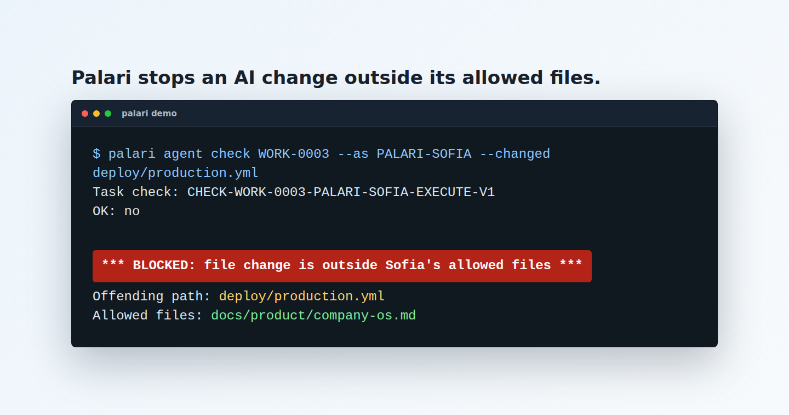

# Palari Company OS

AI agents can change files faster than people can review them. Palari gives
them a visible boundary and stops them when they cross it.



Maya asks Sofia to clean up launch notes.

Sofia is allowed to read the selected notes and change one docs file.

Then Sofia tries to touch `deploy/production.yml`.

Palari stops the run:

```text
*** BLOCKED: file change is outside Sofia's allowed files ***
changed: deploy/production.yml
allowed: docs/product/company-os.md
```

The human sees what Sofia tried, what was allowed, and the next safe command.

That is the product: AI work with a boundary you can inspect.

## Quickstart

Requirements: Python 3.10 or newer and Git.

Zero-install demo (after the first PyPI publish of this version):

```bash
uvx --from palari-company-os palari demo --no-pause
```

See [Release and operations](docs/product/release-and-operations.md) to cut a
tagged release.

Two commands from a fresh clone:

```bash
git clone https://github.com/CoyStan/palari-company-os.git && cd palari-company-os
./bin/palari demo --no-pause
```

Or install from a checkout:

```bash
python3 -m pip install -e .
palari demo --no-pause
```

The offline demo uses a temporary directory. It shows Palari blocking a
disallowed file change, allowing a committed in-bound change, and running the
checks needed to complete safe low-risk local work.

Open the same temporary demo in the local supervision view:

```bash
./bin/palari demo --serve
```

The server listens locally by default. The files remain the source of truth.

See the full [Quickstart](docs/product/quickstart.md) when you are ready to use
Palari in your own repository.

## What Palari does

[](https://github.com/CoyStan/palari-company-os/actions/workflows/ci.yml)
[](https://coystan.github.io/palari-company-os/)
[](pyproject.toml)
[](LICENSE)
[](docs/product/current-product.md)

This repository dogfoods its own agent PRs with evidence/proof ranges. Drop an
unsigned PCAW receipt in the browser verifier
([what it checks](verify/README.md)) or run
`palari proof verify statement.json --subject-root DIR` for full CLI checks.
Demo receipt: `verify/fixtures/accepted/statement.json`.

Palari is a local system that makes AI work reviewable. It helps a human and an
agent agree on:

- the task;
- the files, sources, and actions the agent may use;
- what the run changed or could not finish;
- which checks passed for this exact version;
- whether independent review is required; and
- when a human must approve or reject the result.

Palari works around coding agents and AI tools. It is not a chatbot or model
provider, and it does not automatically merge, deploy, or approve work.

The work process is:

```text
goal
-> task and limits
-> run
-> run record and current check results
-> independent review when required
-> human approval when required
-> result
```

The [Glossary](docs/product/glossary.md) explains the few older technical names
that remain in stable commands, JSON fields, and file paths.

## Use it in your repository

Initialize Palari, add one task, and let an agent take the next safe task:

```bash
palari init --palari Agent --host codex --json
palari work add "Clean up launch notes" --write docs/notes.md --json
palari agent start --next --as PALARI-AGENT --json
```

`init` creates missing `AGENTS.md` and `docs/agent/` guidance without
overwriting existing instructions. In a Git worktree it also makes one local,
path-limited starter commit containing only new Palari records and generated
agent docs. With `--host claude` or `--host codex`, that commit includes new
repository-local host settings and installs the assignment-bound Git commit
check. With `--host cursor`, it installs an advisory project rule; pass
`--strict-git` to include the Git commit check. Unrelated staged and unstaged
work is excluded.

Choose `claude`, `codex`, or `cursor`. Codex asks you to trust the exact
repository hook once through `/hooks`; Palari cannot grant that host trust
itself. Existing root instructions and host configuration stay untouched. Nested
Palari workspaces use the enclosing Git root.

The agent receives a task brief (`packet` in stored JSON and file paths),
portable session rules (`session-contract`), and a local assignment (`claim`).
These technical names remain stable for compatibility; ordinary messages use
the plain words.

After doing and committing the bounded work, use the opaque task ID returned by
`start`:

```bash
palari agent advance WORK-RETURNED-BY-START --as PALARI-AGENT --json
```

Do not infer a sequential task ID. Unrelated opaque IDs can run in parallel.
For a repository that already has Palari records, run this once:

```bash
palari init WORKSPACE-DIR --host HOST --as PALARI-ID --json
```

Other agent tools can follow the provider-neutral repository rules and use the
host-neutral Git check. Claude and Codex have tested structural session
profiles; Cursor has a tested advisory host profile (`palari init --host cursor`)
with an opt-in git commit gate. No profile grants permission to review, approve,
merge, push, deploy, call a provider, or perform an external write.

Use `--write PATH` when only final presence matters. When the kind of change
matters, declare it exactly:

```bash
palari work add "Replace obsolete guidance" \
  --create docs/new.md --modify docs/current.md --delete docs/obsolete.md
```

## The ordinary agent path

Most work needs two commands.

1. Take the next safe task:

   ```bash
   palari agent start --next --as PALARI-CLAUDE --json
   ```

   Palari selects one eligible task, saves its task brief and session rules,
   and creates a local assignment. `agent next`, `brief`, and explicit `start
   WORK-ID` remain available for inspection and controlled selection.

2. After editing and committing only allowed files, run automatic finishing:

   ```bash
   palari agent advance WORK-ID --as PALARI-CLAUDE --json
   ```

   Palari identifies the exact committed change and runs fixed built-in
   verification profiles rather than task prose. For R1 work, the authoritative
   profile is an exact base-to-head `git diff --check` over the changed paths.
   Palari records the run, run record, and current check results. Every
   completion requires current exact checks. Only R1/light work with zero
   required approvals and no external writes may finish without independent
   review and human approval. Every other task stops at the next real boundary.

`agent advance` never records a review result or human approval. Use
`--dry-run` to inspect its plan.

If a task is interrupted, record why before releasing the assignment:

```bash
palari agent release WORK-ID --as PALARI-CLAUDE \
  --reason "Waiting for product direction" \
  --next-action "Ask the founder to choose the final wording" --json
```

This records the blocker and next safe action. It does not invent completion
records or approval. A legacy workspace without writable tamper-evident history
receives an exact `history --checkpoint` command instead.

## The ordinary human path

After an independent review, inspect the concise human handoff and run its
exact human action once:

```bash
palari agent handoff WORK-ID --as PALARI-REVIEWER --mode review --json
# A human runs the exact human_action_commands[].command from this handoff.
```

Initialization provides a distinct review-only agent so a one-person
workspace does not spend its only human authority on review. Before work
starts, Palari checks that the builder, reviewer, and qualified final approver
can remain distinct. The emitted action is an explicit-workspace
`palari approve ... --presented DIGEST` command. The digest is inserted by
Palari, not copied by the human, and binds the action to the presentation just
inspected. `approve` revalidates the exact checks, review, artifact, and journal,
then records approval and local completion in one transaction. If relevant
state changed, approval fails safely with the next correction. A manually
entered bare `approve` command instead derives current state at invocation.

`palari queue --approval-inbox --json` and its
`palari human-decision pack ...` actions remain available for advanced and
batched approval. Agents may present human actions but must not run them.
Supported session hooks block recognized agent invocations, but Palari does
not authenticate processes that share the same operating-system user.

## What works today

Palari is a **v0.2 alpha local CLI**. It uses ordinary local files, has no
runtime package dependencies beyond the Python standard library, and needs no
API key, cloud account, database, or background service for core use.

Implemented now:

- strict local workspace schema and validation;
- bounded tasks with explicit create, modify, and delete paths;
- deterministic safe-task selection and local assignment;
- task briefs and portable session rules for agents;
- current run records, check results, independent reviews, and human approvals;
- one `agent advance` path that completes every safe mechanical step;
- concise queue, detail, state, history, and Mission Control views;
- canonical path and symlink checks, including traversal and sibling-prefix
  defenses;
- an assignment-bound Git commit check and tested Claude and Codex hooks;
- Cursor host adoption via `palari init --host cursor` (advisory rule by default; opt-in git gate with `--strict-git` or `palari cursor install`);
- replayable, tamper-evident history with corruption and crash detection;
- deterministic PCAW v1 export and offline verification;
- an Approval Inbox that safely groups eligible human actions;
- dry-run integration plans and cancelable outbox records;
- a bounded Linear adapter for issue reads/imports, approved comments, approved
  status updates, approved issue creation, and verified webhooks; and
- network-free examples, CI, complete verification, and install smoke tests.

Not implemented:

- a hosted multi-user service;
- a background agent runner;
- authenticated same-user identity or signed key custody;
- autonomous review, approval, merge, push, or deployment;
- live Slack, GitHub, Jira, email, Google Drive, or document writes;
- generic provider execution beyond the approved Linear path; or
- portable deletion-history verification in PCAW v1.

## Portable verification

Palari's protocol is **Proof-Carrying AI Work (PCAW)**. An independent party
can take one canonical statement plus its named artifacts and verify it offline
without the original workspace, AI provider, network, credentials, or source
contents. `artifact`, `subject`, `digest`, and `predicate` remain exact protocol
terms in the normative [PCAW v1 specification](spec/pcaw/v1/README.md).

Run the two-minute network-free demonstration:

```bash
./scripts/pcaw_demo.sh
```

It verifies an accepted output, changes one governed byte, and reports the
exact digest mismatch.

## Useful commands

```bash
# Status views
palari queue
palari detail WORK-ID
palari state

# Tamper-evident history audit and recovery
palari history

# Safety boundaries
palari validate
palari scope WORK-ID --changed docs/notes.md

# Agent path
palari agent next --as PALARI-ID --json
palari agent start --next --as PALARI-ID --json
palari agent brief WORK-ID --as PALARI-ID --mode execute --json
palari agent check WORK-ID --as PALARI-ID --mode execute --json
palari agent advance WORK-ID --as PALARI-ID --json
palari agent release WORK-ID --as PALARI-ID \
  --reason "Paused" --next-action "Resume from the recorded blocker" --json

# Agent-ready repo docs
palari docs check --json
palari docs map
palari docs init --dry-run --json

# Local human supervision
palari serve --as HUMAN-ID
```

Use `--json` when wiring Palari into agents, scripts, or other tools.

## Repository layout

```text
bin/palari                         CLI wrapper
src/palari_company_os/             Python package
schemas/workspace.schema.json      Workspace schema
examples/acme-company-os/          Small example workspace
workspaces/palari-company-os/      Historical, non-live dogfood evidence
docs/product/                      Product and operator documentation
docs/agent/                        Agent-ready repo orientation and rules
scripts/verify.sh                  Complete local verification
scripts/install_smoke.sh           Isolated package install smoke
tests/                             Unit and fixture tests
```

## Golden Paths

- **First run:** run `./bin/palari demo`, or add `--serve` for the local view.
- **Agent loop:** read [Agent Loop Smoke](docs/product/agent-loop-smoke.md).
- **Human loop:** inspect `palari agent handoff WORK-ID --as PALARI-REVIEWER
  --mode review --json`, then have the human run its exact emitted
  `human_action_commands[].command` once.
- **Linear:** read [Linear Operating Loop](docs/product/linear-operating-loop.md).
- **Checks and approval:** read [Checks And Approval](docs/product/authority-and-gates.md).
- **Product map:** read [Public Surface](docs/product/public-surface.md).

## Documentation

Start here:

- [Current Product](docs/product/current-product.md) for what Palari supports;
- [Quickstart](docs/product/quickstart.md) for the shortest command path;
- [Plain Language](docs/product/plain-language.md) for the words people see;
- [Glossary](docs/product/glossary.md) for stable technical names;
- [Agent Contract](docs/product/agent-contract.md) for agent task rules;
- [Command Reference](docs/product/command-reference.md) for CLI details;
- [Minimality Contract](docs/product/minimality-contract.md) for keeping Palari small;
- [Self-Hosting Maintainer Mode](docs/product/self-hosting-maintainer-mode.md)
  for the bounded source-repair exception and isolated-state follow-up;
- [Public Surface](docs/product/public-surface.md) for current, optional, and parked features;
- [Agent Repo Map](docs/agent/repo-map.md) for implementation orientation; and
- [Agent Contracts And Invariants](docs/agent/contracts-and-invariants.md) for
  safety rules agents must preserve.

More detail:

- [Core Objects](docs/product/core-objects.md)
- [Checks And Approval](docs/product/authority-and-gates.md)
- [Stored Data And Validation](docs/product/schema-and-validation.md)
- [Work Process Guide](docs/product/lifecycle-guide.md)
- [Testing Guide](docs/product/testing-guide.md)
- [Security Notes](docs/product/security.md)
- [Parked Roadmap](docs/product/roadmap.md)
- [Changelog](CHANGELOG.md)

## Verification

```bash
python3 -m pip install -e ".[dev]"
./scripts/verify.sh complete
./scripts/verify.sh focused tests.test_agent_packets
```

`complete` is the authoritative local check. It runs the current unit suite,
static and schema checks, PCAW conformance, temporary CLI boundary checks, and
one isolated wheel install smoke. `focused` runs only named test modules and is
not a final approval check.

GitHub Actions runs the complete candidate check once on Python 3.12. Python
3.10, 3.11, 3.13, and 3.14 receive thin source-import, central-rules, and CLI
help compatibility checks.

## Design principles

- **Human approval stays explicit.** AI can prepare and explain work; it cannot
  silently approve, merge, deploy, activate policy, or widen its own limits.
- **Inputs are selected.** An agent should know what it may read and what it
  may not read.
- **Run records explain what happened.** They help humans inspect a run but do
  not replace exact check results.
- **Checks are universal; extra steps follow risk.** Every completion needs
  current exact checks. Review and approval are added when the risk requires
  them.
- **Status views do not grant permission.** Queue, detail, state, and Mission
  Control display recorded decisions; trusted commands enforce them.
- **Ordinary software maintenance wins.** Palari should stay simple,
  inspectable, dependency-light, and easy for humans and agents to change.

## Contributing

Palari is early and changes quickly. Small, focused improvements are preferred.
Good first contributions include documentation fixes, smaller fixtures, command
examples, and tests around existing behavior.

See [Contributing](docs/product/contributing.md) for local development notes.

## License

MIT. See [LICENSE](LICENSE).
